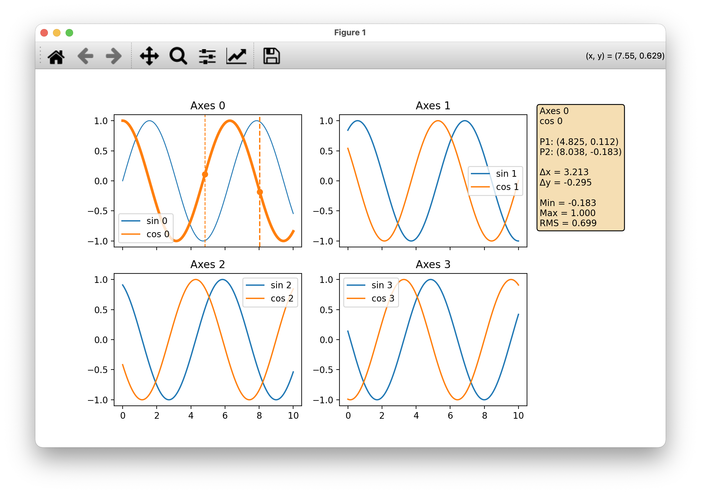

# mpl_measurements
Interactive measurement tools for Matplotlib.

Click two points on any plotted line to compute engineering-style measurements
such as Δx, Δy, and signal statistics (min, max, RMS) over a selected
interval.



To use it, simply call `InteractiveScope(fig)` where `fig` is your figure.
Example:

```python

import numpy as np
import matplotlib.pyplot as plt

from mpl_measurements import InteractiveScope

x = np.linspace(0, 10, 1000)
fig, axs = plt.subplots(2, 2, sharex=True, squeeze=False)

for ii, ax in enumerate(axs):
    ax.plot(x, np.sin(x + ii), label=f"sin {ii}", picker=5)
    ax.plot(x, np.cos(x + ii), label=f"cos {ii}", picker=5)
    ax.set_title(f"Axes {ii}")
    ax.legend()

scope = InteractiveScope(fig) # This is the line!

# You can also call e.g. InteractiveScope(fig, axes=[axs[0], axs[1]]) if you
# want the measurements tool active only on axes axs[0], axs[1]

plt.show()
```
